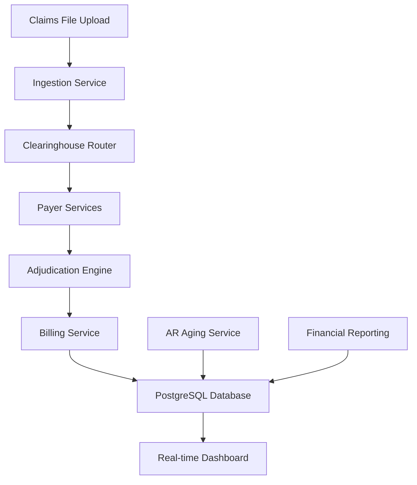

# 🏥 Medical Billing Simulator

A comprehensive medical claims processing simulation system that models real-world healthcare billing workflows with realistic payer interactions, claim adjudication, and financial reporting.

## 📋 Table of Contents

- [Overview](#overview)
- [Architecture](#architecture)
- [Features](#features)
- [Quick Start](#quick-start)
- [Usage Guide](#usage-guide)
- [Configuration](#configuration)
- [API Documentation](#api-documentation)
- [Database Schema](#database-schema)
- [Testing](#testing)
- [Troubleshooting](#troubleshooting)

## 🎯 Overview

This billing simulator processes medical claims through a complete healthcare revenue cycle, from initial claim submission to final payment posting. It simulates real-world scenarios including:

- **Multi-payer processing** (Medicare, Anthem, United Health Group)
- **Complex adjudication rules** (copays, deductibles, coinsurance)
- **Claim denials** with realistic denial reasons and codes
- **AR aging analysis** with industry-standard buckets
- **Real-time financial reporting** and analytics
- **EDI-835 response generation** for industry compliance

## 🏗️ Architecture

### System Overview

```
┌─────────────────┐    ┌─────────────────┐    ┌─────────────────┐
│   Frontend      │    │      API        │    │   PostgreSQL    │
│   (React)       │◄──►│   (Node.js)     │◄──►│   Database      │
│   Port: 5173    │    │   Port: 3001    │    │   Port: 5433    │
└─────────────────┘    └─────────────────┘    └─────────────────┘
                                │
                                ▼
                       ┌─────────────────┐
                       │  Billing Engine │
                       │   (TypeScript)  │
                       └─────────────────┘
```

### Processing Pipeline



### Core Services

#### 1. **Ingestion Service** (`src/services/ingestion/`)
- **Purpose**: Processes uploaded claims files (JSONL format)
- **Features**: Rate limiting, file validation, error handling
- **Output**: Validated claims queued for processing

#### 2. **Clearinghouse Service** (`src/services/clearinghouse/`)
- **Purpose**: Routes claims to appropriate payers
- **Features**: Payer validation, routing logic, load balancing
- **Output**: Claims routed to payer-specific queues

#### 3. **Payer Services** (`src/services/payer/`)
- **Purpose**: Simulates insurance company claim processing
- **Features**: 
  - Configurable adjudication rules per payer
  - Realistic processing delays
  - Denial logic with industry-standard codes
  - EDI-835 response generation
- **Output**: Adjudicated claims with payment decisions

#### 4. **Billing Service** (`src/services/billing/`)
- **Purpose**: Final payment posting and financial reconciliation
- **Features**: Payment posting, patient responsibility calculation, reporting
- **Output**: Completed financial transactions

#### 5. **AR Aging Service** (`src/services/ar-aging/`)
- **Purpose**: Tracks outstanding receivables and aging analysis
- **Features**: Industry-standard aging buckets, alerts, reporting
- **Output**: Aging reports and analytics

### Database Architecture

**PostgreSQL Schema** (`database/schema.sql`):

```sql
-- Main claims table with processing pipeline tracking
claims (
  id SERIAL PRIMARY KEY,
  claim_id VARCHAR(255) UNIQUE,
  status VARCHAR(50), -- received → ingested → routed → adjudicated → billed
  payer_id VARCHAR(100),
  total_amount DECIMAL(10,2),
  paid_amount DECIMAL(10,2),
  patient_responsibility DECIMAL(10,2),
  adjudication_status VARCHAR(50), -- paid, denied, partial
  created_at TIMESTAMP,
  billed_at TIMESTAMP,
  ...
)
```

**Database Views**:
- `processing_stats` - Real-time processing metrics
- `payer_stats` - Per-payer financial breakdown
- `aging_stats` - AR aging analysis with buckets
- `recent_activity` - Latest claim activity feed

## ✨ Features

### 💰 Financial Processing
- **Multi-line adjudication** with service-level detail
- **Complex payment calculations** (payer percentage, copays, deductibles, coinsurance)
- **Patient responsibility tracking** with accurate calculations
- **Denial management** with realistic denial codes and reasons

### 📊 Real-time Analytics
- **Live progress tracking** based on actual claim completion
- **Financial dashboards** with payer breakdowns
- **AR aging analysis** (0-1min, 1-2min, 2-3min, 3+min buckets)
- **Processing throughput metrics**

### ⚙️ Configurable Payers
Each payer supports custom configuration:
```json
{
  "payer_id": "anthem",
  "name": "Anthem",
  "processing_delay_ms": { "min": 100, "max": 500 },
  "adjudication_rules": {
    "payer_percentage": 0.8,
    "copay_fixed_amount": 25,
    "deductible_percentage": 0.1
  },
  "denial_settings": {
    "denial_rate": 0.25,
    "preferred_categories": ["authorization", "medical_necessity"]
  }
}
```

### 🔄 Queue-Based Architecture
- **Asynchronous processing** with in-memory queues
- **Scalable design** supporting high throughput
- **Error handling** and retry logic
- **Real-time status monitoring**

## 🚀 Quick Start

### Prerequisites

- **Node.js 18+** and npm/pnpm
- **PostgreSQL 14+**
- **Docker & Docker Compose** (recommended for database)

### 1. Setup Database

```bash
# Start PostgreSQL via Docker
docker-compose up -d

# Verify containers are running
docker ps
```

### 2. Start the Application

```bash
# One-command startup (includes database setup, build, and service start)
./scripts/start-with-postgresql.sh
```

### 3. Access the Application

- **Frontend**: http://localhost:5173
- **API**: http://localhost:3001
- **Database**: postgresql://localhost:5433/billing_simulator

### 4. Process Your First Claims

```bash
# Generate sample claims
node scripts/generate-claims.js 50 sample-claims.jsonl

# Upload via web interface or API
curl -X POST -F "claimsFile=@sample-claims.jsonl" \
  http://localhost:3001/api/simulator/process
```

## 📖 Usage Guide

### Generating Test Data

```bash
# Generate claims with different volumes
node scripts/generate-claims.js 10 small-test.jsonl      # 10 claims
node scripts/generate-claims.js 100 medium-test.jsonl   # 100 claims  
node scripts/generate-claims.js 1000 large-test.jsonl   # 1000 claims

# Pre-generated files available:
# - test-output.jsonl (5 claims)
# - valid-claims.jsonl (3 claims)
```

### Configuration Modes

#### Fast Demo Mode (Recommended for Testing)
```bash
# Use denial-demo config for quick results
./scripts/demo-denials.sh
```
- Processing: 100-700ms per claim
- High activity and visual feedback
- Perfect for demonstrations

#### Realistic Mode
```bash
# Use default config for realistic timing  
# Claims process in 30-180 seconds (like real healthcare)
./scripts/start-with-postgresql.sh
```

### Web Interface Usage

1. **Start Processing**
   - Click "Start Simulator"
   - Select configuration preset
   - Upload claims file (JSONL format)

2. **Monitor Progress** 
   - Real-time progress bar shows completion
   - View processing statistics by service
   - Monitor payer-specific metrics

3. **Analyze Results**
   - Financial summary with totals
   - Payer breakdown charts  
   - AR aging analysis
   - Recent activity feed

### API Usage

#### Start Simulator
```bash
POST /api/simulator/start
Content-Type: application/json

{
  "configFile": "denial-demo.json"
}
```

#### Upload Claims
```bash
POST /api/simulator/process  
Content-Type: multipart/form-data

claimsFile: [JSONL file]
```

#### Get Status
```bash
GET /api/simulator/status

Response:
{
  "isRunning": true,
  "status": {
    "progress": 45,
    "processedClaims": 23,
    "totalClaims": 50
  },
  "stats": {
    "billing": {
      "totalBilledAmount": 12750.50,
      "totalPaidAmount": 8942.35,
      "deniedClaims": 3
    },
    "aging": [...],
    "payers": [...]
  }
}
```

### Database Queries

```sql
-- View all claims with their status
SELECT claim_id, status, payer_name, total_amount, paid_amount 
FROM claims ORDER BY created_at DESC;

-- Get processing statistics  
SELECT * FROM processing_stats;

-- Analyze payer performance
SELECT * FROM payer_stats ORDER BY payment_rate_percent DESC;

-- Check AR aging buckets
SELECT * FROM aging_stats;
```

## ⚙️ Configuration

### Configuration Files (`config/`)

- **`default.json`** - Realistic healthcare timing (30-180 sec delays)
- **`denial-demo.json`** - Fast demo mode (100-700ms delays)  
- **`high-performance.json`** - Optimized for maximum throughput
- **`single-process.json`** - Single-threaded processing

### Payer Configuration

```json
{
  "payer_id": "medicare",
  "name": "Medicare", 
  "processing_delay_ms": { "min": 30000, "max": 90000 },
  "adjudication_rules": {
    "payer_percentage": 0.80,      // Payer pays 80%
    "copay_fixed_amount": 20,      // $20 copay
    "deductible_percentage": 0.20   // 20% deductible
  },
  "denial_settings": {
    "denial_rate": 0.05,           // 5% denial rate
    "hard_denial_rate": 0.60,      // 60% are hard denials
    "preferred_categories": ["MEDICAL_NECESSITY"]
  }
}
```

### Environment Variables

```bash
# Database connection
DB_HOST=localhost
DB_PORT=5433
DB_USER=postgres
DB_PASSWORD=postgres

# API configuration  
API_PORT=3001
NODE_ENV=development
```

## 📡 API Documentation

### Endpoints

| Endpoint | Method | Description |
|----------|--------|-------------|
| `/api/simulator/start` | POST | Start processing engine |
| `/api/simulator/stop` | POST | Stop processing engine |
| `/api/simulator/status` | GET | Get real-time status |
| `/api/simulator/process` | POST | Upload & process claims |
| `/api/simulator/results` | GET | Get processing results |
| `/api/config/presets` | GET | List configuration presets |

### Response Format

All API responses follow this structure:
```json
{
  "success": true,
  "data": { ... },
  "error": null,
  "timestamp": "2025-01-15T10:30:00Z"
}
```

## 🗄️ Database Schema

### Main Tables

- **`claims`** - Core claims data with processing status
- **`processing_stats`** - Real-time processing metrics (view)
- **`payer_stats`** - Payer-specific performance metrics (view)
- **`aging_stats`** - AR aging analysis (view)

### Key Indexes

- `idx_claims_status` - Query by processing status
- `idx_claims_payer_id` - Payer-specific queries  
- `idx_claims_created_at` - Time-based queries

## 🧪 Testing

### Unit Tests

```bash
# Run all tests
cd src && pnpm test

# Run specific test suite
pnpm test -- --testPathPattern=payer

# Run with coverage
pnpm test -- --coverage
```

### Integration Testing

```bash
# Test database integration
node test-postgresql-integration.js

# Test full processing pipeline
./scripts/test-service-parallelization.sh
```

### Demo Scripts

```bash
# Denial demonstration
./scripts/demo-denials.sh

# AR aging demonstration  
./scripts/demo-aging-buckets.sh
```

## 🛠️ Management Scripts

### Service Management

```bash
# Start all services
./scripts/start-with-postgresql.sh

# Stop all services (Ctrl+C or:)
./scripts/stop-all-services.sh

# Start single process mode
./scripts/start-single-process.sh
```

### Database Management

```bash
# Setup database schema
./scripts/setup-postgresql.sh

# Clear all claims data
./scripts/clear-claims.sh

# Clear with no confirmation
./scripts/clear-claims.sh --force
```

### Data Generation

```bash
# Generate test claims
node scripts/generate-claims.js [count] [filename]

# Examples:
node scripts/generate-claims.js 100 test.jsonl
node scripts/generate-claims.js 1000 large-test.jsonl
```

## 🔧 Troubleshooting

### Common Issues

#### 1. Database Connection Failed
```bash
# Check PostgreSQL is running
docker ps

# Restart database
docker-compose down && docker-compose up -d

# Verify connection
psql -h localhost -p 5433 -U postgres -d billing_simulator
```

#### 2. Ports Already in Use
```bash
# Kill processes on required ports
./scripts/stop-all-services.sh

# Or manually kill specific ports
lsof -ti:3001 | xargs kill -9  # API
lsof -ti:5173 | xargs kill -9  # Frontend
```

#### 3. Build Failures
```bash
# Clean and rebuild
npm run clean
npm install
npm run build
```

#### 4. Slow Processing with Default Config
The default configuration uses realistic healthcare timing (30-180 seconds per claim). For faster testing:

```bash
# Use demo configuration instead
./scripts/demo-denials.sh
```

#### 5. Claims Stuck in Processing
```bash
# Check database status
psql -h localhost -p 5433 -U postgres -d billing_simulator \
  -c "SELECT status, COUNT(*) FROM claims GROUP BY status;"

# Clear and restart if needed
./scripts/clear-claims.sh --force
```

### Logs and Debugging

```bash
# View API logs (when started with start-with-postgresql.sh)
tail -f api.log

# View frontend logs
tail -f frontend.log

# Database query logs
tail -f /var/log/postgresql/postgresql-*.log
```

### Performance Tuning

```bash
# Use high-performance configuration
cp config/high-performance.json config/custom.json

# Monitor system resources
htop
iostat 1

# Database performance
psql -h localhost -p 5433 -U postgres -d billing_simulator \
  -c "SELECT * FROM pg_stat_activity;"
```

## 📞 Support

For issues, questions, or contributions:

1. Check the troubleshooting section above
2. Review the logs for error messages  
3. Verify all prerequisites are installed
4. Test with sample data first

## 🏗️ Architecture Notes

This simulator uses a **monorepo pattern** with:

- **`src/`** - Core processing services (TypeScript)
- **`api/`** - REST API server (Node.js)  
- **`frontend/`** - React web application
- **`packages/shared/`** - Shared utilities and types
- **`scripts/`** - Management and utility scripts
- **`config/`** - Configuration presets
- **`database/`** - Schema and setup scripts

The system is designed for **educational and demonstration purposes** to showcase modern healthcare billing workflows, real-time data processing, and full-stack web development patterns.